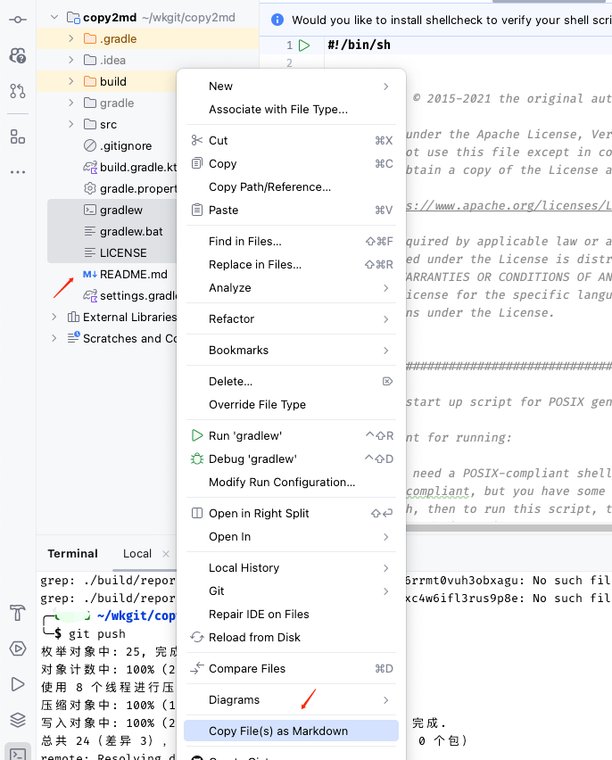
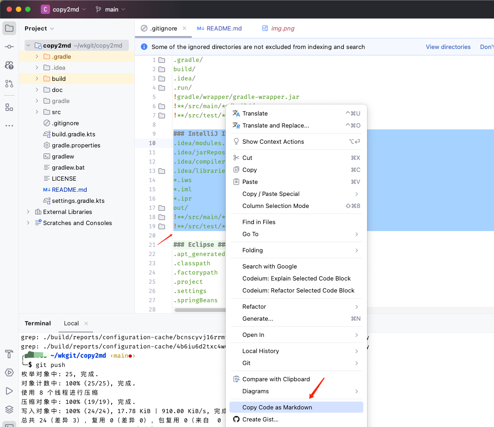
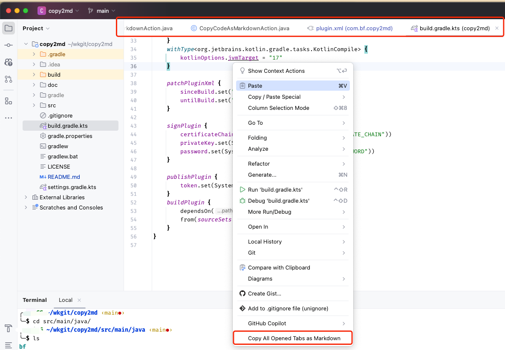

# Copy as Markdown 

## Description
This is a simple tool to copy the content of a file to the clipboard in markdown format.

## Usage
### Copy selected file(s) as Markdown to clipboard

### Copy selected code as Markdown to clipboard

### Copy All Opened Tabs as Markdown
